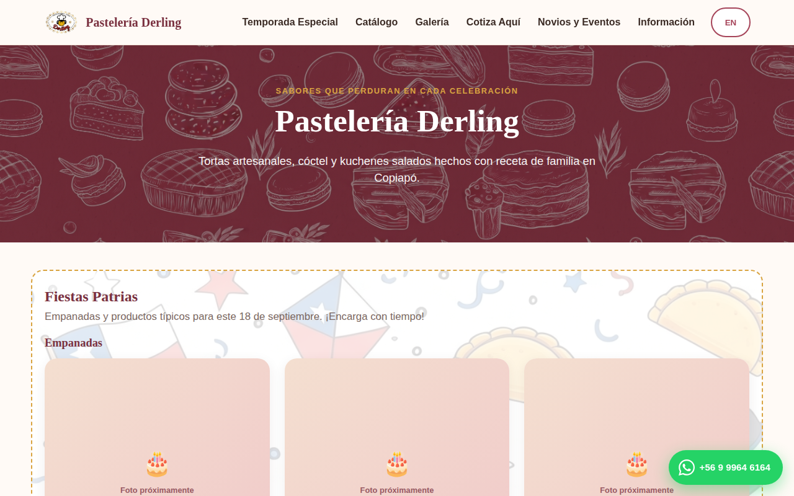
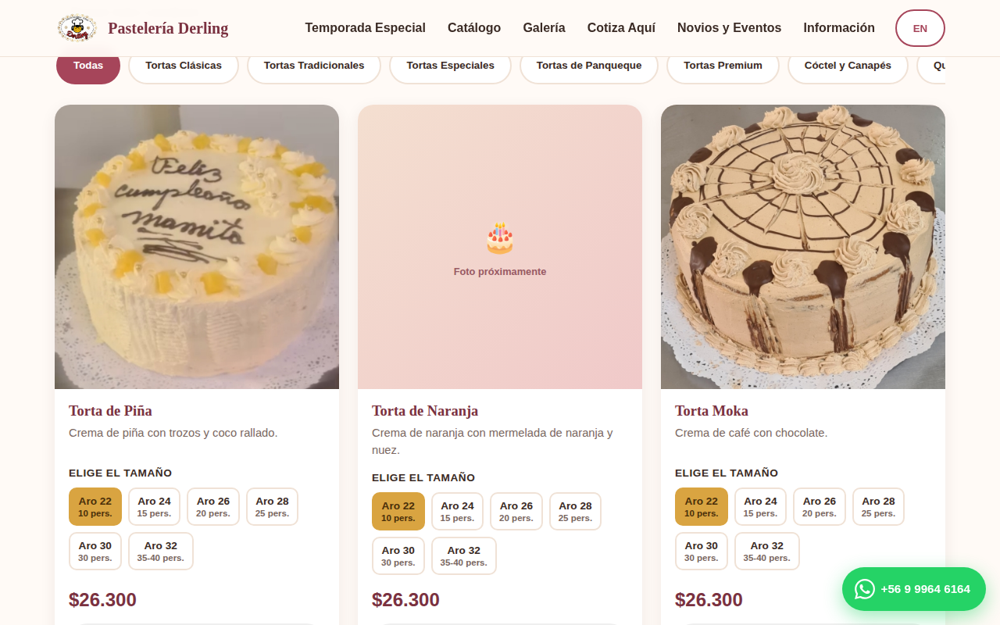
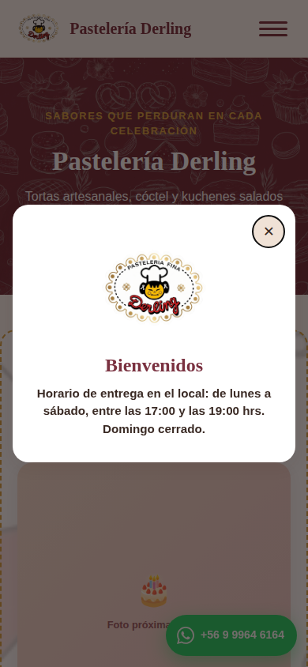
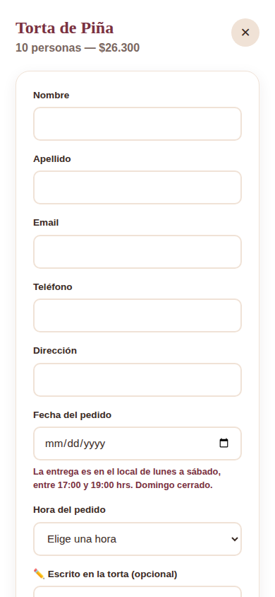

<div align="center">

# 🎂 Pastelería Derling

**Catálogo web para una pastelería artesanal en Copiapó, Chile** — bilingüe, 100% responsivo, con pedidos por WhatsApp y cero dependencias externas.

[🔗 Ver sitio en vivo](https://TU-SITIO.netlify.app) · [📋 Reportar un problema](../../issues)


</div>

---

## 📸 Vista previa

<table>
<tr>
<td width="50%"></td>
<td width="50%"></td>
</tr>
<tr>
<td width="50%"></td>
<td width="50%"></td>
</tr>
</table>

## ✨ Funcionalidades

- **Catálogo interactivo** — más de 50 productos (tortas, cóctel, quiches) con selector de tamaño/porciones que actualiza el precio en pesos chilenos al instante.
- **Bilingüe (ES/EN)** — un botón cambia todo el contenido, incluidos los mensajes de WhatsApp, sin recargar la página ni depender de un servicio de traducción pago.
- **Panel de pedido** — al presionar "Pedir aquí" se abre un panel (lateral en escritorio, pantalla completa en celular) que reúne los datos del cliente y arma un mensaje de WhatsApp listo para enviar.
- **Cotizador de pedidos múltiples** — formulario aparte para pedidos con varios productos a la vez, enviable por WhatsApp o por correo (Gmail).
- **Reglas de negocio reales** — el calendario de entrega bloquea los domingos en tiempo real y limita el horario disponible (17:00–19:00) a intervalos de 30 minutos.
- **Temporada especial** — sección destacada y activable/desactivable (ej. Fiestas Patrias) sin tocar el resto del sitio.
- **Buscador con autocompletado** — filtra el catálogo mientras se escribe, ignorando tildes.
- **Mapa embebido** — vista previa de la ubicación en la misma página, con modal ampliable.
- **Botón flotante de WhatsApp** — siempre visible, con el número real del negocio.

## 🔒 Seguridad

Construido siguiendo prácticas de OWASP y buenas prácticas de seguridad web, sin depender de un framework que las imponga por defecto:

- **Content Security Policy** estricta vía archivo `_headers` (Netlify): sin `unsafe-inline`, sin `unsafe-eval`.
- **Cero uso de `innerHTML`** — todo el DOM se construye con `createElement` / `textContent`, eliminando el vector de XSS más común en sitios hechos a mano.
- **Enlaces externos sanitizados** — todo dato dinámico en URLs pasa por `encodeURIComponent`; enlaces a otras pestañas usan `rel="noopener noreferrer"`.
- **Cabeceras adicionales**: `X-Frame-Options`, `X-Content-Type-Options`, `Referrer-Policy`, `Permissions-Policy` (cámara/micrófono bloqueados), `Strict-Transport-Security`.
- **Degradación segura** — cualquier imagen faltante (logo, fotos de producto) cae a un ícono decorativo en vez de romper el layout o mostrar un ícono de "imagen rota".

## 🛠️ Stack técnico

**HTML5 + CSS3 + JavaScript vanilla — sin frameworks, sin librerías, sin paso de build.**

Es una decisión de diseño, no una limitación: el sitio pesa poco, carga rápido incluso en conexiones móviles lentas, no tiene dependencias que puedan quedar desactualizadas o con vulnerabilidades, y cualquiera puede editarlo con solo un Bloc de notas — importante porque el sitio está pensado para que la propia dueña del negocio, sin conocimientos de programación, pueda actualizar productos, precios y fotos.

| | |
|---|---|
| **Maquetado** | CSS Grid + Flexbox, mobile-first, sin media queries innecesarias |
| **Interactividad** | JavaScript ES6+ nativo, DOM API |
| **Íconos** | SVG dibujados a mano (WhatsApp, Instagram, Facebook, teléfono, correo) |
| **Internacionalización** | Sistema propio de textos ES/EN por diccionario |
| **Hosting** | Netlify (deploy continuo desde esta rama de GitHub) |
| **Accesibilidad** | HTML semántico, `aria-label`, foco visible, tamaños táctiles ≥44px |

## 📁 Estructura del proyecto

```
PasteleriaDerling/
├── index.html          # Estructura de la página (una sola página, sin build)
├── styles.css           # Todos los estilos
├── script.js             # Datos del catálogo + toda la lógica de la página
├── _headers              # Cabeceras de seguridad para Netlify
├── images/                # Fotos, logo y fondos (con guía LEEME.txt)
└── docs/screenshots/       # Capturas usadas en este README
```

Todo el contenido editable (nombres, precios, horarios, datos de contacto) vive en bloques claramente comentados al principio de `script.js` — pensado para que se pueda modificar sin tocar el resto del código.

## 🚀 Cómo correrlo localmente

No requiere instalar nada. Basta con abrir `index.html` en un navegador, o servirlo con cualquier servidor estático:

```bash
git clone https://github.com/RoseJulieth/PasteleriaDerling.git
cd PasteleriaDerling
git checkout claude/bakery-catalog-website-f31hgy
python3 -m http.server 8000
# abrir http://localhost:8000
```

## 👩‍💻 Autoría

Desarrollado por **[Rose Julieth](https://github.com/RoseJulieth)** para Pastelería Derling (Copiapó, Chile).

---

<div align="center">
<sub>© 2026 Pastelería Derling. Sitio de uso comercial del negocio.</sub>
</div>
